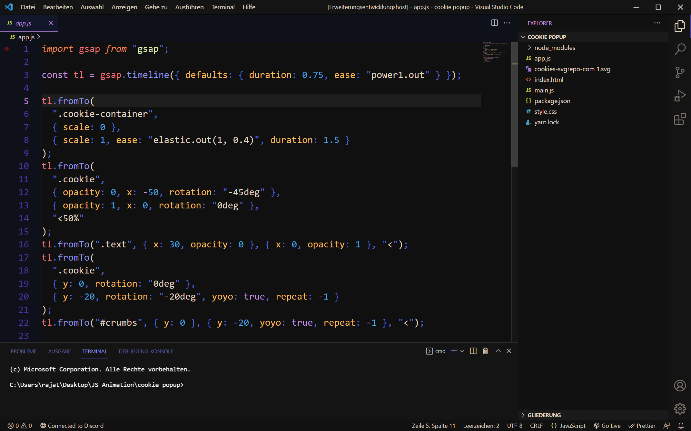

# README

---

## About

My own custom vscode theme.

---

## How to install

> Download this repository and move all files in a single folder. Copy that folder inside your usefolder/.vscode/extensions. After that go to your Editor and apply theme.

**Enjoy!**
